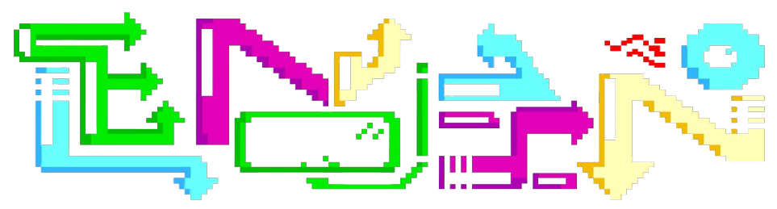
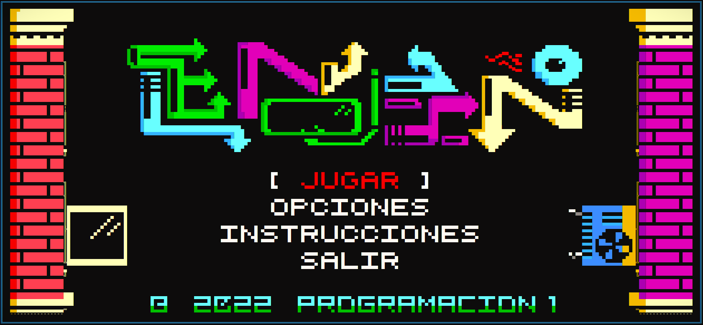

<a id="readme-top"></a>

<p align='center'> 
  &nbsp;
  &nbsp;
  &nbsp;
  &nbsp;
</p>

<!-- PROJECT LOGO -->
<br>
<div align="center">
   
  <h3 align="center">El-MOLINO-v1.0</h3>
  <p align="center">
    An incredible visual and fun console GAME
    <br>
    <a href="https://github.com/AAL1X/El_Molino-v1.0"><strong>Explore the docs »</strong></a>
    <br>
    <br>
    <a href="https://github.com/AAL1X/El_Molino-v1.0">View Demo</a>
    ·
    <a href="https://github.com/AAL1X/AAL1X/issues/new?labels=bug&template=bug-report---.md">Report Bug</a>
    ·
    <a href="https://github.com/AAL1X/AAL1X/issues/new?labels=enhancement&template=feature-request---.md">Request Feature</a>
  </p>
</div>

<!-- TABLE OF CONTENTS -->
<details>
  <summary>Table of Contents</summary>
  <ol>
    <li>
      <a href="#about-the-project">About The Project</a>
      <ul>
        <li><a href="#built-with">Built With</a></li>
      </ul>
    </li>
    <li>
      <a href="#getting-started">Getting Started</a>
      <ul>
        <li><a href="#prerequisites">Prerequisites</a></li>
        <li><a href="#installation">Installation</a></li>
      </ul>
    </li>
    <li><a href="#usage">Usage</a></li>
    <li><a href="#roadmap">Roadmap</a></li>
    <li><a href="#contributing">Contributing</a></li>
    <li><a href="#contact">Contact</a></li>
  </ol>
</details>

<!-- ABOUT THE PROJECT -->
## About The Project


El Molino es un juego de consola desarrollado en C++ que explora gráficos detallados en un entorno clásico de consola. Este proyecto fue creado con el objetivo de brindar una experiencia nostálgica y visualmente atractiva, aprovechando el poder de los gráficos en ASCII.

Here's why:
* My motivation for creating "El Molino" was to offer a classic game with detailed graphics, while improving my development skills.
* This game combines strategy and intelligence in a challenging console format, ideal for taking on a friend and testing your skills.

Of course, this is a trial version. In future updates, I will optimize the code to improve the gaming experience.
<p align="right">(<a href="#readme-top">back to top</a>)</p>

### Built With
* &nbsp;
* &nbsp;
* &nbsp;
* &nbsp;
<p align="right">(<a href="#readme-top">back to top</a>)</p>

<!-- GETTING STARTED -->
## Getting Started
These are instructions on how to configure your project locally. To get a local copy up and running, follow these simple example steps.

### Prerequisites
These are the items needed to use the software and how to install them:
* C++ compiler (for example, GCC or Clang)
* Development environment (Visual Studio IDE)

### Installation
_Below is an example of how to install and configure "El Molino" on your local machine._

1. Clone the repository
   ```sh
   git clone https://github.com/AAL1X/El_Molino-v1.0.git
   ```
2. Navigate to the project directory
   ```sh
   cd El_Molino-v1.0
   ```
3. Compile the project If you are using a C++ compiler such as `g++`,
you can compile the main file. Make sure you include all necessary files.
   ```sh
   g++ -o ElMolino main.cpp
   ```
4. Run the game
   ```sh
   ./ElMolino
   ```
5. (Optional) Change the Git remote URL to prevent accidental pushes to the base project
   ```sh
   git remote set-url origin https://github.com/tu_usuario/el_molino
   git remote -v #confirm the changes
   ```
<p align="right">(<a href="#readme-top">back to top</a>)</p>


<!-- USAGE EXAMPLES -->
## Usage

<p align="right">(<a href="#readme-top">back to top</a>)</p>


<!-- ROADMAP -->
## Roadmap

<p align="right">(<a href="#readme-top">back to top</a>)</p>


<!-- CONTRIBUTING -->
## Contributing
Contributions are what make the open source community an amazing place to learn, be inspired, and create. Any contribution you wish to make is very welcome!

If you have a suggestion to improve the project, you can fork the repository and open a pull request.
Don't forget to give the project a star! Thanks for contributing!

1. Fork the project.
2. Create a branch for your improvement (`git checkout -b feature/NewImprovement`).
3. Make your changes and commit (`'git commit -m 'Add New Improvement'`).
4. Push your changes to the branch (`git push origin feature/NewImprovement`).
5. Open a pull request.
<p align="right">(<a href="#readme-top">back to top</a>)</p>

### Top contributors:

<!-- CONTACT -->
## Contact
<p align="center">
  <a href="mailto:leonardobravoricapa@gmail.com"></a>
  <a href="https://www.instagram.com/leonm.br"></a>
  <a href="https://aal1x-jobhub.github.io/jobhub-landing/"></a>
  <a href="https://www.linkedin.com/in/leonardo-bravo-4120b8228/"></a>
</p>
<p align="right">(<a href="#readme-top">back to top</a>)</p>